# Space Quiz
 
Welcome to my quiz on all things space! Space quiz tests the users knowledge on space and planets whilst ensuring that it is fun and colourful.

 
 
 It will generate 10 random questions and then let the user know their score at the end.

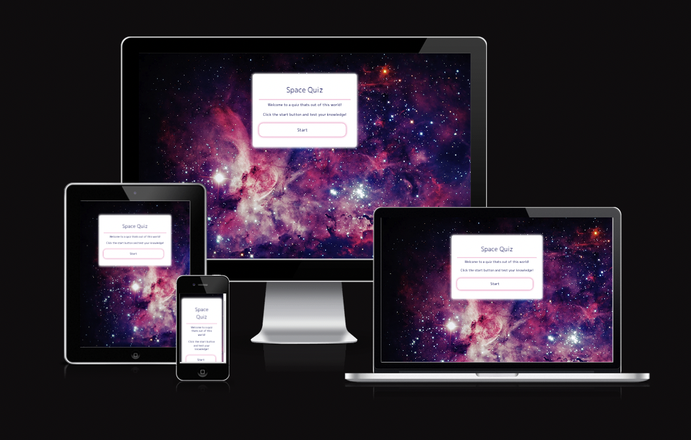

# Table of contents

- [1. Website Goals](#1-website-goals)
- [2. Live Website](#2-live-website)
- [3. Color Pallete](#3-color-pallete)
- [4.Features](#4-features)
- [5. Technologies Used](#5-technologies-used)
- [6. Testing](#6-testing)
- [7. Deployment](#7-deployment)
- [8. Achknowledgements and Credits](#8-achknowledgements-and-credits)

 

## 1. Website Goals:

- I built this quiz to be fun and educational.
- The quiz is aimed at primary school children.
- I wanted the quiz to be bold and colourful but to be easy to read and navigate through.
- The goal of the site is to provide a challenging quiz to entertain online users most.

 

## 2. Live Website:

- The quiz can be found by clicking the following link -
  [Space Quiz](https://developerdunne.github.io/Space-Quiz/)

   

## 3. Color pallete:

- The quiz was designed to keep the same color pallete throughout to ensure continuity. The colours used are below and were sourced from [coolors.co](https://coolors.co/)

 

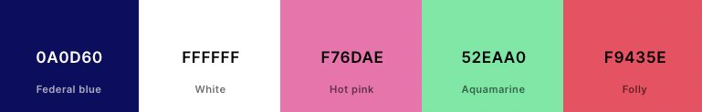

## Features:

### The Landing Page:

- When the page loads you are presented with the landing page which displays some brief instructions and a start button for you to begin the quiz, the quiz will pick 10 random questions from an array of 15 potential questions.

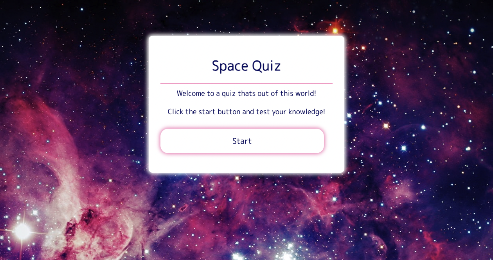

### Choosing an answer:

- Once you click the start button you are presented with a question. If you are on a desktop as you hover over each potential answer it will change colour.

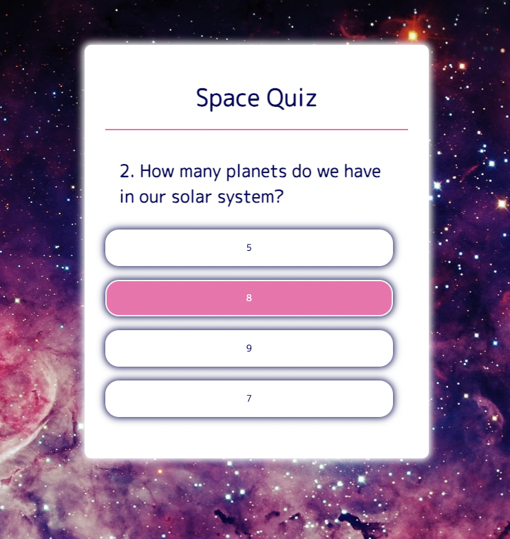

### The correct answer:

- Once you click on your answer, if correct the answer will change to green and you will be presented with a next button to carry on to the next question.

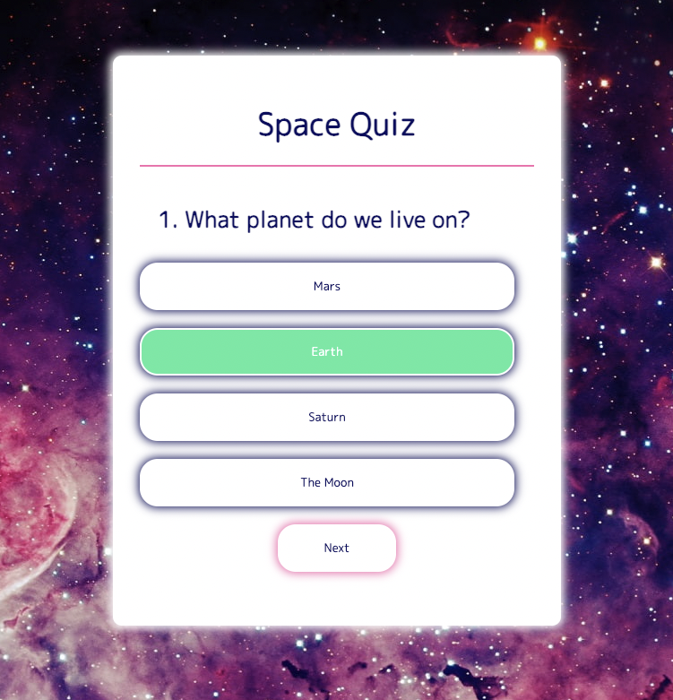

### The wrong answer:

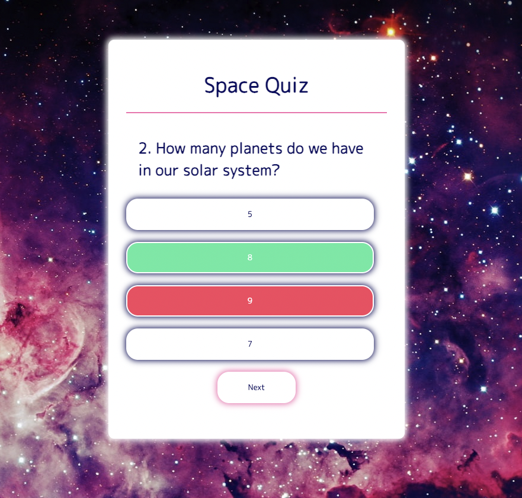

- However, if you click on the incorrect answer it will change to red and then you will be presented with a next button to carry on to the next question.

### End of quiz:

- Once you have completed the 10 questions of the quiz and clicked next you will be shown your score. The message displayed will vary considering on how many answers you got correct.

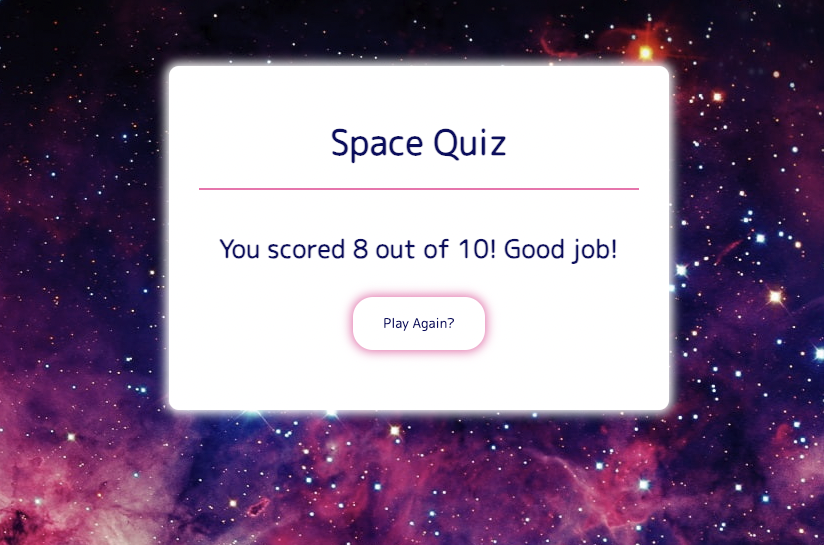

### Features left to implement:
- I would have liked to implement a score leaderboard at the end of the quiz but ran out of time.

## 4. Technologies Used:

### Languages:

- HTML: This was used to create the basic structure of the quiz.
- CSS: This was used to style the content.
- Javascript: This was used in order to ensure the quiz was interactive.

 

## 5. Testing:

### Manual:

- The quiz was tested manually using DevTools.
- It was tested on Chrome and Safari.
- It was tested on all devices such as mobile, tablet and laptop to ensure responsiveness.
- Friends and family members were also asked to test the website.

### Testing programmes run:

#### Am I responsive:

  - The image of what the website looks on different devices was taken from [Am I Responsive?](https://ui.dev/amiresponsive) (See preview at top of page.)

#### LightHouse:

- I ran the website through 'Lighthouse in Devtools.

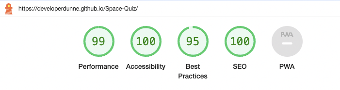

#### HTML Validator:

- No errors were displayed when putting the code through the official W3C Validator.

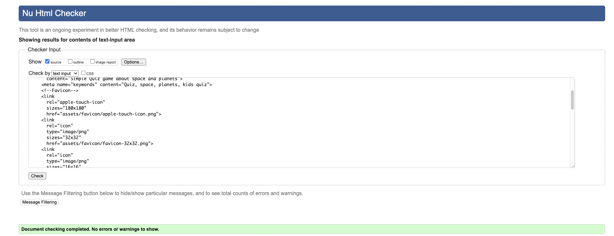

#### CSS Validator:

- No errors were displayed when putting the code through the official (Jigsaw) Validator.

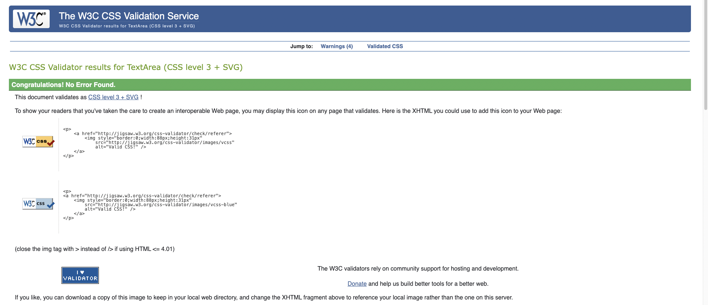

#### JSHint:

- I ran my Javascript code through JShint and only had the one warning which I was unable to work out how to remove. I discussed this with peers who stated they had the same issue and that this particular one is okay to remain.

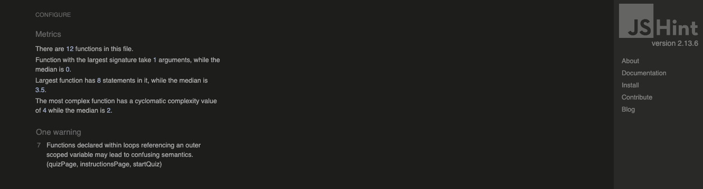

  

 ### Bugs solved:

 - When I ran my Javascript code through JShint I got a few warnings about using 'let' and 'const'. I saw advice from the slack community who told me to include (/*jshint esversion: 6 */) at the top of my code and that solved the problem.

### Unfixed Bugs:

- I am unsure as to why however since switching form CodeAnywhere to VS code it seem that it show 2 contributors on GitHub rather than one, this is even though it is just myself working on the project.

  

## 6. Deployment:

### GitHub pages deployment:

Once the webiste is deployed you can view it online, to do this:

- Log in to GitHub

- In the Repository section, select the project that you want to deploy.

- In the menu located at the top of the page, click 'Settings'.

- Select 'Pages' on the left-hand menu.

- Go to the source section, select branch 'Master' and save.

- The page is then given a site URL which you will see above the source section, please note this may take a minute before you can see it.

 

## 7. Achknowledgements and Credits:

### Design Credits:

- Balsamiq: This was used to design the website before building.
- [Google Fonts](https://fonts.google.com/): Fonts used were from here.
- [Favicon.io](https://favicon.io/): Favicon was taken from here.

### Achknowledements and Credits:

- Ideas were taken from the Code Institute's Love Maths project and google for design ideas.
- W3 Schools was used to combat any issues with code or if I was stuck (e.g - how to disable hover once answer selected).
- My mentor, Medale Oluwafemi for his guidance and support throughout the project.
