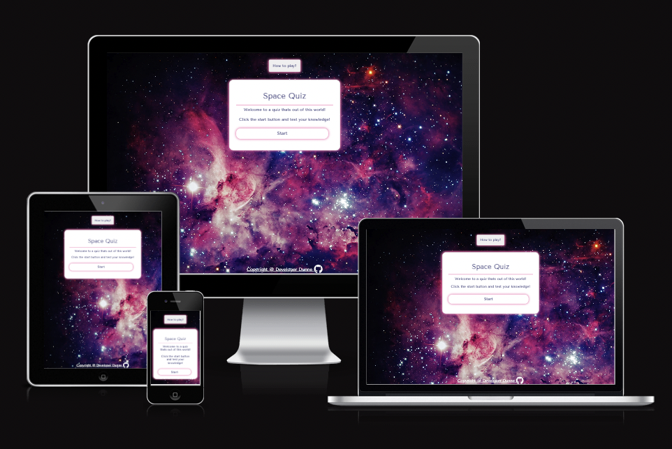
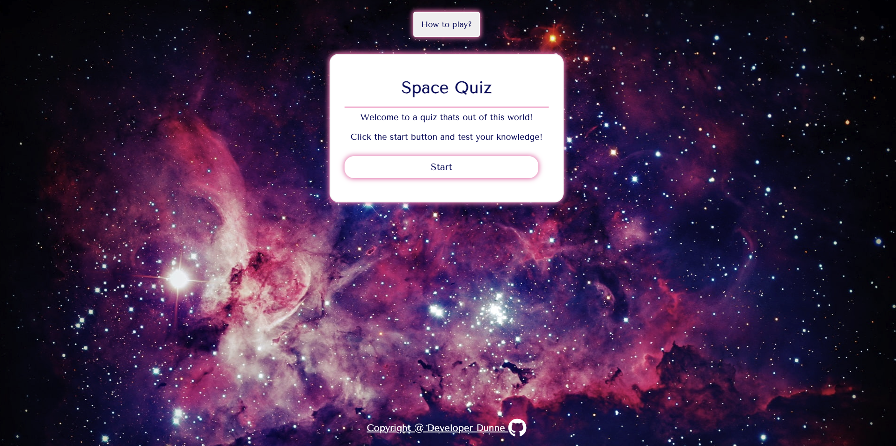
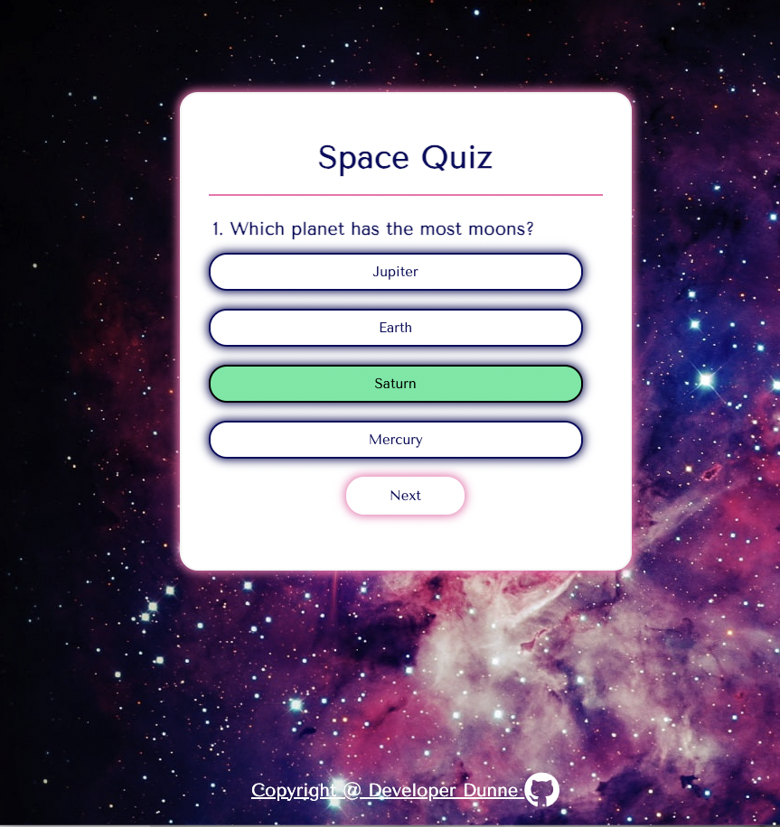

# Space Quiz
 
Welcome to my quiz on all things space! Space quiz tests the users knowledge on space and planets whilst ensuring that it is fun and colourful.

 
 
 It will generate 10 random questions and then let the user know their score at the end.

# Table of contents

- [1. Goals](#1-goals)
- [2. Live Website](#2-live-website)
- [3. Color Pallete](#3-color-pallete)
- [4. Features](#4-features)
- [5. Technologies Used](#5-technologies-used)
- [6. Testing](#6-testing)
- [7. Deployment](#7-deployment)
- [8. Achknowledgements and Credits](#8-achknowledgements-and-credits)

 

## 1. Goals:

### Developer Goals:

- I would like this quiz to be fun and educational.
- The quiz is aimed at primary school children.
- I wanted the quiz to be bold and colourful but to be easy to read and navigate through.
- The goal of the site is to provide a challenging quiz to entertain online users most.

### User Exeperience /Goals:

- I would like to see what the quiz is going to be about.
- I would like the quiz to be fun.
- I would like to know how to play the quiz.
- I would like to see my score.
- I would like to be able to try to beat my score.

 

## 2. Live Website:

- The quiz can be found by clicking the following link -
  [Space Quiz](https://developerdunne.github.io/Space-Quiz/)

   

## 3. Color pallete:

- The quiz was designed to keep the same color pallete throughout to ensure continuity. The colours used are below and were sourced from [coolors.co](https://coolors.co/).
- The colours were checked with a contrast checker at [WebAIM](https://webaim.org/resources/contrastchecker/?fcolor=02AFD0&bcolor=FFFF00).

 

## 4. Features:

### The Landing Page:

- When the page loads you are presented with the landing page, as shown the background is a colourful version of space and you are shown some text and a start button for you to begin the quiz. This style continues throughout the quiz. The quiz will pick 10 random questions from an array of 15 potential questions.

### How to play button:

- The 'How to play' button stores the instructions for the game. Once clicked a modal will open and display information on how to use the quiz. When the quiz starts this button will automatically disappear.

### The Modal:

- The Modal will open once the 'How to play' button is clicked. Here you will find clear instructions on how the quiz works and how to get started. You can exit the modal by clicking the pink cross in the top right corner or alternitivly clicking outside the modal.

### Link to Github:

- At the bottom of the page in the footer is a link that will take you to the repository page of the creator of the webiste. This will open in a new tab.

### Choosing an answer:

- Once you click the start button you are presented with a question. If you are on a desktop when you hover over each potential answer it will change colour.

### The correct answer:

- Once you click on your answer, if correct the answer will change to green and you will be presented with a next button to carry on to the next question.

### The wrong answer:

- However, if you click on the incorrect answer it will change to red and then you will be presented with the correct answer marked in gree. The next button to carry on to the next question will also appear..

### End of quiz:

- Once you have completed the 10 questions of the quiz and clicked next you will be shown your score. The message displayed will vary considering on how many answers you got correct.

### Features left to implement:
- I would have liked to implement a username and score leaderboard at the end of the quiz but ran out of time.

## 4. Technologies Used:

### Languages:

- HTML: This was used to create the basic structure of the quiz.
- CSS: This was used to style the content.
- Javascript: This was used in order to ensure the quiz was interactive.

 

## 5. Testing:

### Manual:

- The quiz was tested manually using DevTools.
- It was tested on Chrome and Safari.
- It was tested on all devices such as mobile, tablet and laptop to ensure responsiveness.
- Friends and family members were also asked to test the website.

| | Mobile S (320px)| Mobile L (425px)| Tablet (768px) | Desktop (1024px)|
|---|:---:|:---:|:---:|:---:|
|Responsive Elements|✓|✓|✓|✓|
|Responsive Text|✓|✓|✓|✓|

|Index Page Testing|Yes/No|
|---|:---:|
|A background image and main page loads and is responsive across all screen sizes|✓|
|How to play button appears on loadup|✓|
|How to play button when clicked opens modal|✓|
|A link at bottom of page navigates to a new tab and desired website|✓| 

|Quiz Page Testing|Yes/No|
|---|:---:|
|Quiz question generated when start button clicked|✓|
|When user selects an answer a new question is generated|✓|
|When user gets correct answer, it is highlighted green and score increases by 1 point|✓|
|When user gets incorrect answer, it is highlighted red and correct answer is shown|✓|
|When quiz finishes, final score is shown and option to play again appears|✓|

---

### 6. Testing programmes run:

#### Am I responsive:

  - The image of what the website looks on different devices was taken from [Am I Responsive?](https://ui.dev/amiresponsive) (See preview at top of page.)

#### LightHouse:

- I ran the website through 'Lighthouse in Devtools.

#### HTML Validator:

- No errors were displayed when putting the code through the official W3C Validator.

#### CSS Validator:

- No errors were displayed when putting the code through the official (Jigsaw) Validator.

#### JSHint:

- I ran my Javascript code through JShint and only had the one warning which I was unable to work out how to remove. I discussed this with peers who stated they had the same issue and that this particular one is okay to remain.

  

 ### Bugs solved:

 - When I ran my Javascript code through JShint I got a few warnings about using 'let' and 'const'. I saw advice from the slack community who told me to include (/*jshint esversion: 6 */) at the top of my code and that solved the problem.

### Unfixed Bugs:

- I am unsure as to why however since switching form CodeAnywhere to VS code it seem that it show 2 contributors on GitHub rather than one, this is even though it is just myself working on the project.

- There was a warnng on JShint regarding functions in loops, I discussed this with my mentor and other students who advised that this wasnt an issue.

  

## 7. Deployment:

### GitHub pages deployment:

Once the webiste is deployed you can view it online, to do this:

- Log in to GitHub

- In the Repository section, select the project that you want to deploy.

- In the menu located at the top of the page, click 'Settings'.

- Select 'Pages' on the left-hand menu.

- Go to the source section, select branch 'Master' and save.

- The page is then given a site URL which you will see above the source section, please note this may take a minute before you can see it.

### Cloning:

- Go to the repository on GitHub.
- Click on the Code button and copy the https URL under Clone
- Open a terminal.
- Go to the folder you want to store the cloned repository
- In the terminal type git clone and paste the URL of the cloned repository after it then press Enter
- The site will then be cloned to that directory

 

## 8. Achknowledgements and Credits:

### Design Credits:

- Github icon was obtained from [Font Awesome](https://fontawesome.com/).
- Balsamiq was used to design the website before building.
- Fonts used were from [Google Fonts](https://fonts.google.com/).
- Favicon was taken from [Favicon.io](https://favicon.io/).
- The background picture was taken from [HD Wallpapers](https://www.hdwallpapers.in/purple_pink_galaxy_space_stars_nebula_hd_space-wallpapers.html)

### Achknowledements and Credits:

- Ideas were taken from the Code Institute's Love Maths project and google for design ideas.
- W3 Schools and copyprogramming.com was used to combat any issues with code or if I was stuck (e.g - how to disable hover effect once answer selected & appending child elements).
- W3 School was also used to create a modal on the landing page.
- I would like to thank the Slack community and my mentor, Medale Oluwafemi for their guidance and support throughout the project.
